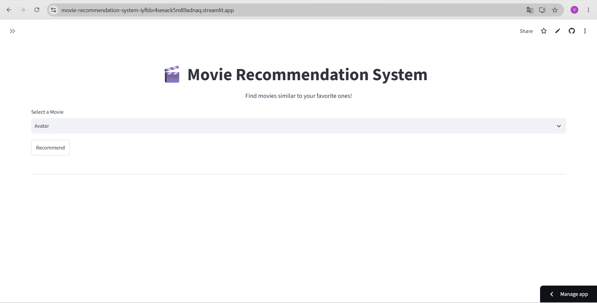
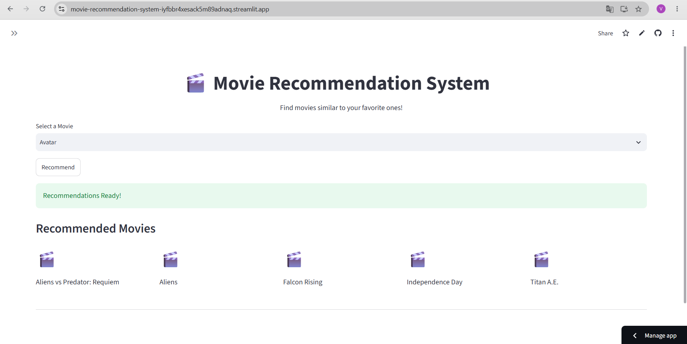

# 🎬 Movie Recommendation System

A content-based movie recommendation system built using Machine Learning and Streamlit.

## 🚀 Live Demo

https://movie-recommendation-system-iyfbbr4xesack5m89adnaq.streamlit.app/

## 📌 Features

- Recommend similar movies
- Interactive Streamlit web app
- Content-based filtering using NLP
- Fast recommendations
- Clean and responsive UI

## 🛠 Tech Stack

- Python
- Pandas
- NumPy
- Scikit-learn
- NLTK
- Streamlit
- Git & GitHub

## 📂 Dataset

TMDB 5000 Movie Dataset

---

## 📷 Screenshots

### Home Page



### Recommendations



### Loading Screen


### Sidebar


---

## ⚙️ Installation

```bash
git clone https://github.com/VivekVaii/Movie-Recommendation-System.git

cd Movie-Recommendation-System

pip install -r requirements.txt

streamlit run app.py
```

---

## 🧠 How It Works

1. Clean movie metadata.
2. Combine overview, genres, keywords, cast, and crew.
3. Apply stemming using NLTK.
4. Convert text into vectors using CountVectorizer.
5. Calculate cosine similarity.
6. Recommend the top 5 similar movies.

---

## 👨‍💻 Author

**Vivek Chaudhary**

GitHub: https://github.com/VivekVaii